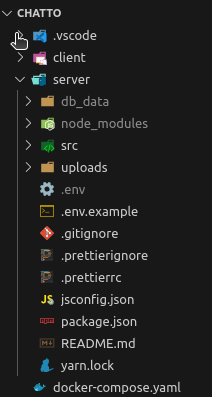

# Chatto

## Before running frontend and backend
- Create `db_data` folder in `server`
- 
- Run Postgres database: `docker compose up -d`
## Backend
- Install: `yarn install`
- Run: `yarn dev`
## Frontend
- Install: `yarn install`
- Run: `yarn dev`
